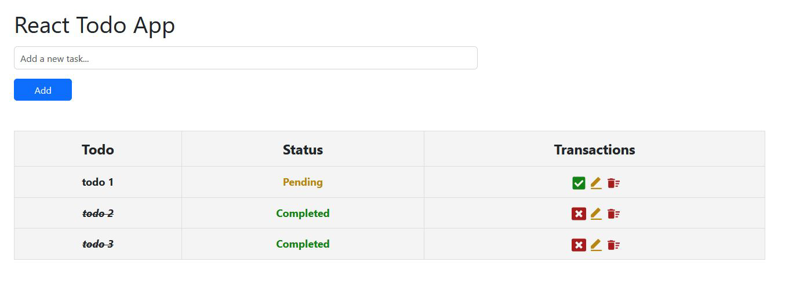

# React Todo App

A simple and clean Todo application built with React.

## Features

- Add / delete todos
- Edit todos inline
- Mark as completed or pending
- Persist data using localStorage
- Responsive layout with Bootstrap
- Icons with react-icons

## Technologies

- React
- Hooks (useState, useEffect)
- Bootstrap
- LocalStorage

## Getting Started

npm install
npm run dev

